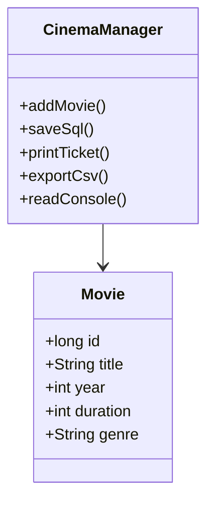

# Modèle UML initial à critiquer

```mermaid
classDiagram
    class Movie {
        +long id
        +String title
        +int year
        +int duration
        +String genre
    }
    class CinemaManager {
        +addMovie()
        +saveSql()
        +printTicket()
        +exportCsv()
        +readConsole()
    }
    CinemaManager --> Movie
```

Questions : quelles règles sont absentes ? Quelles responsabilités sont mélangées ? Quelles relations métier devraient apparaître ?
